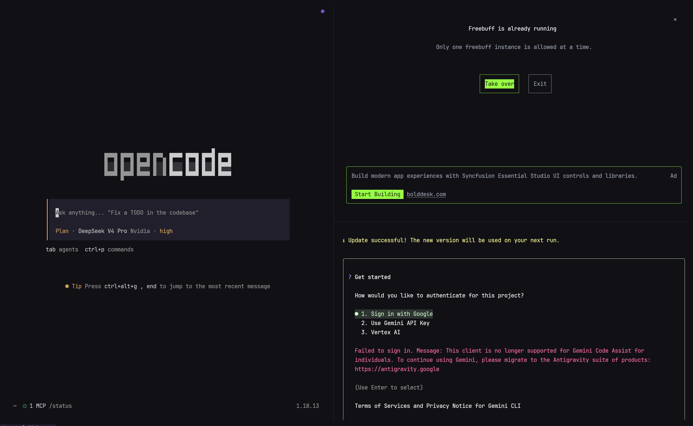

<div align="center">
  
  <h1>MANDA</h1>
  <p><em>A fast, out-of-the-box terminal built for AI coding.</em></p>
</div>

<p align="center">
  <a href="https://github.com/DCORVAX/manda/stargazers"></a>
  <a href="https://manda-terminal.vercel.app/"></a>
  <a href="LICENSE.md"></a>
  <a href="https://github.com/DCORVAX/manda/commits"></a>
</p>

<p align="center">
  
</p>

## Why

MANDA is a deeply customized fork of WezTerm, built for practical defaults on day one while keeping full Lua customization and a fast, lightweight feel. Designed for AI-assisted coding workflows with built-in provider presets for NVIDIA, Gemini, OpenRouter, Groq, and Cerebras.

## Features

- **Zero Config**: Defaults with JetBrains Mono, macOS font rendering, and low-res font sizing.
- **Theme-Aware Experience**: Auto-switches between dark and light modes with macOS, with tuned selection colors, font weight, and practical color overrides support.
- **Curated Shell Suite**: Built-in zsh plugins with optional CLI tools for prompt, diff, and navigation workflows.
- **Fast & Lightweight**: 40% smaller binary, instant startup, lazy loading, stripped-down GPU-accelerated core.
- **WezTerm-Compatible Config**: Use WezTerm's Lua config directly with full API compatibility and no migration.
- **Polished Defaults**: Copy on select, clickable file paths, history peek from full-screen apps, pane input broadcast, and visual bell on background tab completion.

## Quick Start

**Option A — Homebrew (recommended)**:

```bash
brew install dcorvax/tap/manda
```

**Option B — one-liner installer** (downloads the DMG from GitHub Releases):

```bash
curl -fsSL https://raw.githubusercontent.com/DCORVAX/manda/main/install/install.sh | bash
```

**Option C — manual**: download `MANDA.dmg` from the [releases page](https://github.com/DCORVAX/manda/releases) and drag `MANDA.app` to Applications.

On first launch, MANDA sets up your shell environment automatically. The current v0.1.1 build uses an ad-hoc signature — if macOS shows "developer cannot be verified", right-click the app → Open.

## Usage Guide

| Action | Shortcut |
| :--- | :--- |
| New Tab | `Cmd + T` |
| New Window | `Cmd + N` |
| Close Tab/Pane | `Cmd + W` |
| Navigate Tabs | `Cmd + Shift + [` / `]` or `Cmd + 1–9` |
| Navigate Panes | `Cmd + Opt + Arrows` |
| Split Pane Vertical | `Cmd + D` |
| Split Pane Horizontal | `Cmd + Shift + D` |
| Open Settings Panel | `Cmd + ,` |
| AI Panel | `Cmd + Shift + A` |
| AI Chat | `Cmd + L` |
| Apply AI Suggestion | `Cmd + Shift + E` |
| Open Lazygit | `Cmd + Shift + G` |
| Yazi File Manager | `Cmd + Shift + Y` or `y` |
| Clear Screen | `Cmd + K` |

Full keybinding reference: [docs/keybindings.md](docs/keybindings.md)

## MANDA AI

MANDA has a built-in assistant with two modes, a full-featured chat panel, and provider presets for NVIDIA, Gemini, OpenRouter, Groq, and Cerebras.

- **Error recovery**: When a command fails, MANDA automatically suggests a fix. Press `Cmd + Shift + E` to apply.
- **Natural language to command**: Type `# <description>` at the prompt and press Enter. MANDA sends the query to the LLM and injects the resulting command back into the prompt, ready to review and run.
- **AI chat panel** (`Cmd + L`): streaming Markdown chat with project context, tools, memory, and slash commands (`/help` lists them all; try `/commit`, `/check`, `/hunt`).
- **AI Tools Config**: Manage settings for Claude Code, Codex, Gemini CLI, Copilot CLI, Kimi Code, and more.
- **Opt-in telemetry**: set `MANDA_TELEMETRY=1` or `telemetry = true` in `assistant.toml` for anonymous local usage stats.

### Assistant Setup

Run `manda ai` to configure the assistant fields directly:

| Field | Use |
| :--- | :--- |
| Auth Type | API key or Codex CLI login |
| Simple Model | Lightweight command generation and quick chat model |
| Deep Model | Primary `Cmd + L` / `m` chat model |
| Base URL | OpenAI-compatible API root, such as `https://api.openai.com/v1` |
| API Key | Provider API key when Auth Type is API key |

Full AI assistant docs: [docs/features.md](docs/features.md)

## Performance

| Metric | Upstream | MANDA | Methodology |
| :--- | :--- | :--- | :--- |
| **Executable Size** | ~67 MB | ~40 MB | Aggressive symbol stripping & feature pruning |
| **Resources Volume** | ~100 MB | ~80 MB | Asset optimization & lazy-loaded assets |
| **Launch Latency** | Standard | Instant | Just-in-time initialization |
| **Shell Bootstrap** | ~200ms | ~100ms | Optimized environment provisioning |

## FAQ

**Is there a Windows or Linux version?** Not currently. MANDA is macOS-only for now.

**Can I use transparent windows?** Yes, set `config.window_background_opacity` in `~/.config/manda/manda.lua`.

**The `manda` command is missing.** Run `/Applications/Manda.app/Contents/MacOS/manda init --update-only && exec zsh -l`, then `manda doctor`.

Full FAQ: [docs/faq.md](docs/faq.md)

## Docs

- [Keybindings](docs/keybindings.md) - full shortcut reference
- [Features](docs/features.md) - AI assistant, lazygit, yazi, remote files, shell suite
- [Configuration](docs/configuration.md) - themes, fonts, custom keybindings, Lua API
- [CLI Reference](docs/cli.md) - `manda ai`, `manda config`, `manda doctor`, and more
- [FAQ](docs/faq.md) - common questions and troubleshooting

## Background

MANDA is built on top of WezTerm's robust and highly hackable engine. It adds AI-first features, curated provider presets, and polished defaults for developers who want speed, simplicity, and AI coding assistance in one terminal.

## Website

The landing page source lives in [`web/`](web/index.html) and deploys to [manda-terminal.vercel.app](https://manda-terminal.vercel.app/).

## Support

- If MANDA helped you, give it a star, [share it](https://twitter.com/intent/tweet?url=https://github.com/DCORVAX/manda&text=MANDA%20-%20A%20fast%20terminal%20built%20for%20AI%20coding.), or open an issue or PR.

## License

MIT License, feel free to enjoy and participate in open source.
